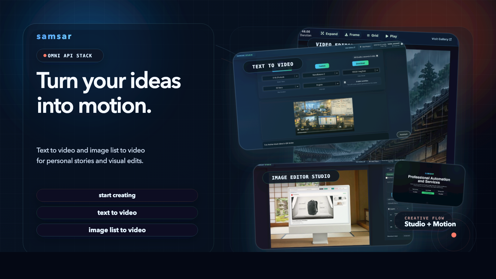
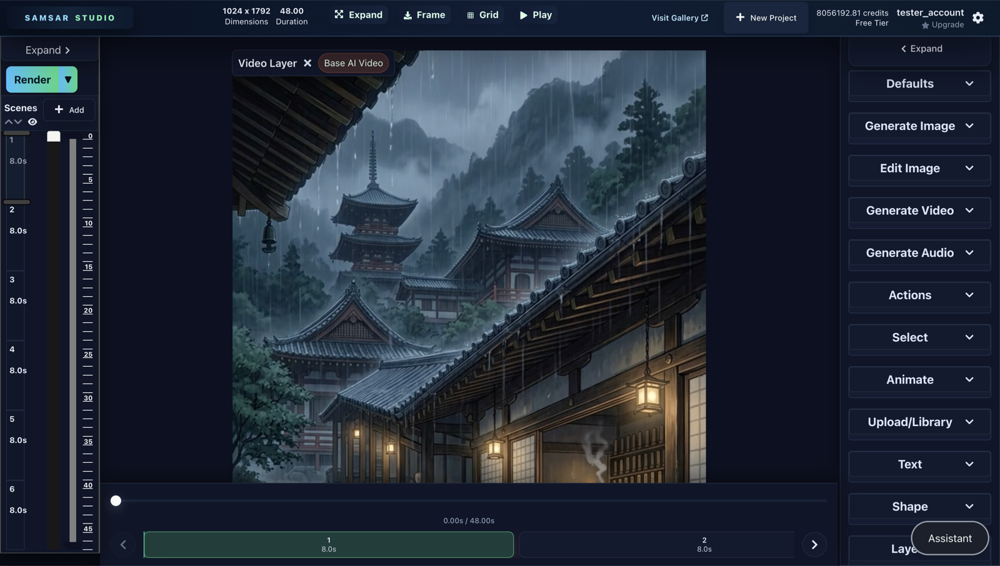
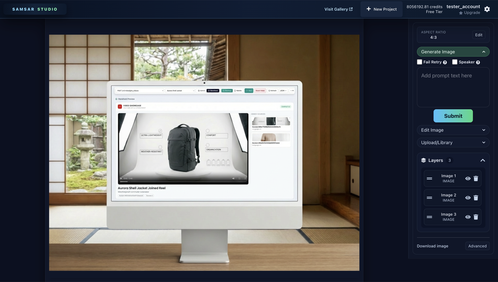
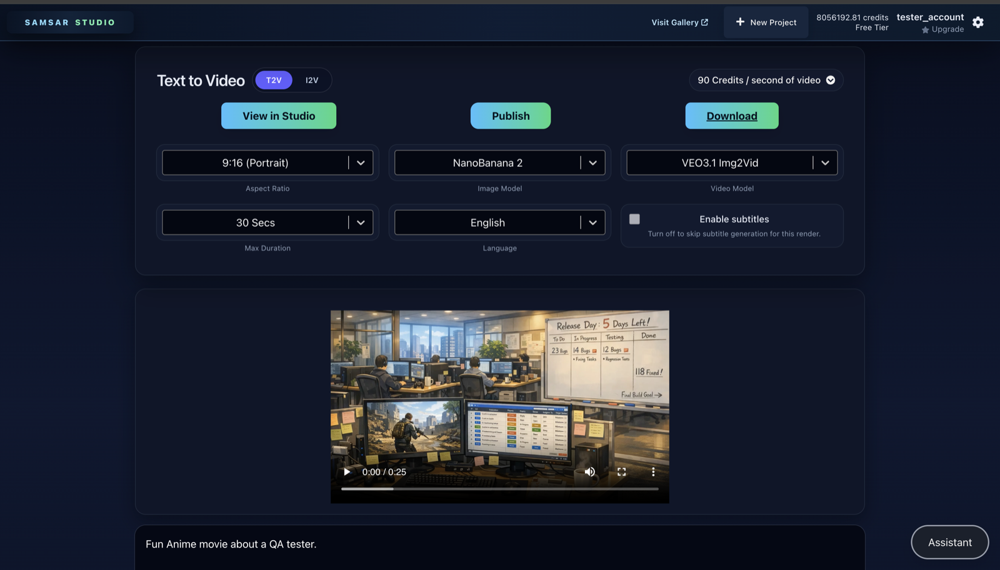

# Samsar Studio Client




Samsar Studio Client is the React + Vite frontend for Samsar's image, video, and audio creation workflows.

It currently ships three connected creation surfaces:

- **Studio** for multi-scene video editing, AI generation, audio, animation, and publishing.
- **Image Studio** for standalone image generation, prompt editing, inpainting, upload/library workflows, and layered export.
- **VidGenie** for one-shot video creation with `Text to Video` and `Image List to Video` modes, with direct handoff back into Studio.

- Hosted app: [app.samsar.one](https://app.samsar.one)
- API and product docs: [docs.samsar.one](https://docs.samsar.one)

## Workflow Overview

| Surface | Route | Best for | Main options |
| --- | --- | --- | --- |
| Studio | `/video/:id` | Full project editing and finishing | Timeline scenes, defaults, image/video/audio generation, image editing, actions, animation, text, shapes, layers, publish/export |
| Image Studio | `/image/studio/:id` | Standalone image workflows | Generate image, edit image, upload/library, layers, canvas presets, simple/advanced download |
| VidGenie | `/vidgenie/:id` | Fast one-shot creation | `T2V` prompt flow, `I2V` image-list flow, subtitles, language, publish/download, `View in Studio` |

Legacy `/vidgpt/:id` and `/videogpt/:id` routes still resolve to the current VidGenie experience.

## Product Surfaces

### Studio



Studio is the full editor. The current toolbar layout includes `Defaults`, `Generate Image`, `Edit Image`, `Generate Video`, `Generate Audio`, `Actions`, `Select`, `Animate`, `Upload/Library`, `Text`, `Shape`, and `Layers`. It is the right surface for multi-scene work, AI-assisted iteration, lip sync, synced sound effects, subtitle alignment, and final publish/export.

### Image Studio



Image Studio is the dedicated image workspace. It exposes `Generate Image`, `Edit Image`, and `Upload/Library` directly in the toolbar, supports layered canvases, custom canvas sizes, preset aspect ratios, prompt-based edits, masked inpaint edits, and simple or advanced downloads. The standalone image workspace uses the same shared image-generation and image-edit pipelines as Studio, but with a more streamlined editing UI.

### VidGenie



VidGenie is the fast one-shot creator:

- `T2V` lets you pick an image model, a video model, aspect ratio, duration, language, and subtitle behavior from one screen.
- `I2V` accepts one or more uploaded images plus an optional prompt hint, then runs the image-list-to-video pipeline.
- Both modes can hand the output back into Studio with `View in Studio`.

## Supported Providers And Models

The tables below reflect the current client-side model configuration in `src/constants/Types.ts` and `src/constants/ModelPrices.jsx`.

### Image Generation

These models are part of the current shared client-side image generation pool. Studio exposes model selection directly, Image Studio uses the same generation pipeline in a simplified flow, and VidGenie exposes a curated subset for `T2V`.

| Model | Key | 1:1 | 16:9 | 9:16 | VidGenie `T2V` |
| --- | --- | ---: | ---: | ---: | --- |
| GPT Image 1.5 | `GPTIMAGE1` | 23 | 23 | 23 | Yes |
| Google Imagen4 | `IMAGEN4` | 8 | 8 | 8 | No |
| Seedream | `SEEDREAM` | 15 | 23 | 23 | Yes |
| Hunyuan | `HUNYUAN` | 60 | 60 | 60 | No |
| NanoBanana 2 | `NANOBANANA2` | 23 | 23 | 23 | Yes |

### Image Editing

These edit models are part of the current shared client-side image editing pipeline. Studio exposes model selection directly, while Image Studio focuses the UI on the edit flow itself.

| Model | Key | Edit mode | Prompt input | 1:1 | 16:9 | 9:16 |
| --- | --- | --- | --- | ---: | ---: | ---: |
| NanoBanana 2 Edit | `NANOBANANA2EDIT` | Prompt edit | Yes | 45 | 45 | 45 |
| GPT Image 1.5 Edit | `GPTIMAGE1EDIT` | Inpaint | Yes | 45 | 45 | 45 |

Notes:

- `GPTIMAGE1EDIT` uses the inpaint flow with a mask brush.
- Image Studio also supports canvas preset changes and custom canvas sizes before generation or editing.

### Video Generation

Studio exposes the full video model list. VidGenie `T2V` exposes a curated subset from the same pool.

| Model | Key | `T2V` | `I2V` | Supported ratios | VidGenie `T2V` |
| --- | --- | --- | --- | --- | --- |
| Runway Gen-4 | `RUNWAYML` | Yes | Yes | `16:9`, `9:16` | Yes |
| Sora 2 | `SORA2` | Yes | Yes | `16:9`, `9:16` | No |
| Sora 2 Pro | `SORA2PRO` | Yes | Yes | `16:9`, `9:16` | Yes |
| Kling 3 Pro Img2Vid | `KLINGIMGTOVID3PRO` | No | Yes | `16:9`, `9:16`, `1:1` | Yes |
| Hailuo O2 Standard | `HAILUO` | Yes | Yes | `16:9` | No |
| Hailuo O2 Pro | `HAILUOPRO` | Yes | Yes | `16:9` | No |
| SeeDance Img2Vid | `SEEDANCEI2V` | No | Yes | `16:9`, `9:16` | Yes |
| Veo 3.1 Img2Vid | `VEO3.1I2V` | Yes | Yes | `16:9`, `9:16` | Yes |
| Veo 3.1 Fast Img2Vid | `VEO3.1I2VFAST` | Yes | Yes | `16:9`, `9:16` | Yes |

### VidGenie Current Options

`T2V` currently exposes:

- Image models: `GPTIMAGE1`, `NANOBANANA2`, `SEEDREAM`
- Video models: `VEO3.1I2V`, `VEO3.1I2VFAST`, `SEEDANCEI2V`, `KLINGIMGTOVID3PRO`, `RUNWAYML`, `SORA2PRO`
- Aspect ratios: `16:9`, `9:16`
- Durations: `10`, `30`, `60`, `90`, `120`, `180` seconds
- Language selector plus optional subtitles
- Voice dictation for prompt entry

`I2V` currently exposes:

- Multi-image upload plus optional prompt guidance
- Aspect ratio, language, and subtitle controls
- Direct call into the image-list-to-video creator flow
- `View in Studio`, publish, and download after render

### Audio And Post-Processing Providers

Studio also includes the following non-generation provider groups:

- Speech/TTS: `OpenAI`, `PlayAI`, `ElevenLabs`
- Music: `CassetteAI`, `AudioCraft`, `Lyria 2`, `ElevenLabs Music`
- Lip sync: `HummingBird Lip Sync`, `Latent Sync`, `Sync Lip Sync`, `Kling Lip Sync`, `Creatify Lip Sync`
- Synced sound effects: `MMAudio V2`, `Mirelo AI`

## Local Development

1. Copy the local environment file:

   ```sh
   cp .env.example .env
   ```

2. Install dependencies:

   ```sh
   yarn install
   ```

3. Start the app:

   ```sh
   yarn start
   ```

The dev server is intentionally pinned to port `3000`, and `VITE_CLIENT_URL` in `.env.example` is already set to `http://localhost:3000`. Keep that port for local Google OAuth flows.

### Default Local Environment

```env
VITE_PROCESSOR_API=https://api.samsar.one
VITE_CLIENT_URL=http://localhost:3000
VITE_CURRENT_ENV=production
VITE_STATIC_CDN_URL=https://static.samsar.one
```

### Build

```sh
yarn build
```

## Pricing Snapshot

<details>
<summary>Current credit pricing from <code>src/constants/ModelPrices.jsx</code></summary>

### Image Generation

| Key | 1:1 | 16:9 | 9:16 |
| --- | ---: | ---: | ---: |
| `GPTIMAGE1` | 23 | 23 | 23 |
| `IMAGEN4` | 8 | 8 | 8 |
| `SEEDREAM` | 15 | 23 | 23 |
| `HUNYUAN` | 60 | 60 | 60 |
| `NANOBANANA2` | 23 | 23 | 23 |

### Image Editing

| Key | 1:1 | 16:9 | 9:16 |
| --- | ---: | ---: | ---: |
| `NANOBANANA2EDIT` | 45 | 45 | 45 |
| `GPTIMAGE1EDIT` | 45 | 45 | 45 |

### Video Generation

| Key | Ratios | Units | Credits |
| --- | --- | --- | --- |
| `RUNWAYML` | `16:9`, `9:16` | `5`, `10` | 90 |
| `SORA2` | `16:9`, `9:16` | `8` | 150 |
| `SORA2PRO` | `16:9`, `9:16` | `8` | 450 |
| `KLINGIMGTOVID3PRO` | `1:1`, `16:9`, `9:16` | `5`, `10` | 90 |
| `HAILUO` | `16:9` | `6`, `10` | 90 |
| `HAILUOPRO` | `16:9` | `6` | 150 |
| `SEEDANCEI2V` | `16:9`, `9:16` | `5`, `10` | 90 |
| `VEO3.1I2V` | `16:9`, `9:16` | `8` | 1050 |
| `VEO3.1I2VFAST` | `16:9`, `9:16` | `8` | 450 |

### Post-Processing

| Key | 1:1 | 16:9 | 9:16 | Units |
| --- | ---: | ---: | ---: | --- |
| `SYNCLIPSYNC` | 15 | 15 | 15 | - |
| `LATENTSYNC` | 15 | 15 | 15 | - |
| `KLINGLIPSYNC` | 15 | 15 | 15 | - |
| `HUMMINGBIRDLIPSYNC` | 15 | 15 | 15 | - |
| `CREATIFYLIPSYNC` | 15 | 15 | 15 | - |
| `MMAUDIOV2` | 15 | 15 | 15 | `5`, `10` |
| `MIRELOAI` | 15 | 15 | 15 | `5`, `10` |

</details>

## Community

- Discord: [discord.gg/2tbhKwRy](https://discord.gg/2tbhKwRy)
- Gallery: [youtube.com/@samsar_one](https://www.youtube.com/@samsar_one)
- X: [x.com/samsar_one](https://x.com/samsar_one)
- Threads: [threads.net/@samsar_one_videos](https://www.threads.net/@samsar_one_videos)

Contributions and pull requests are welcome.
